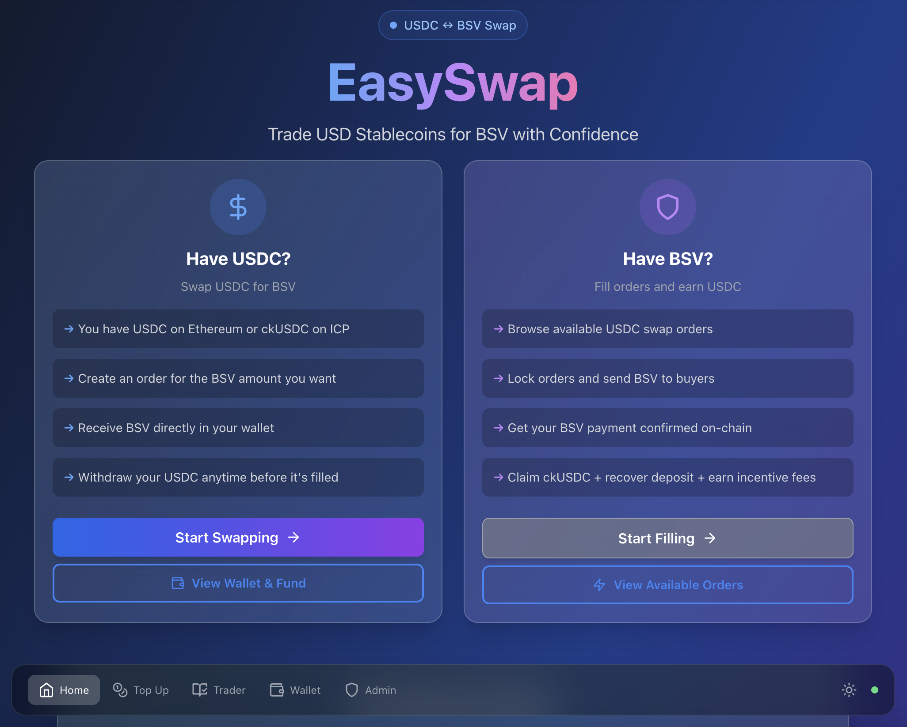
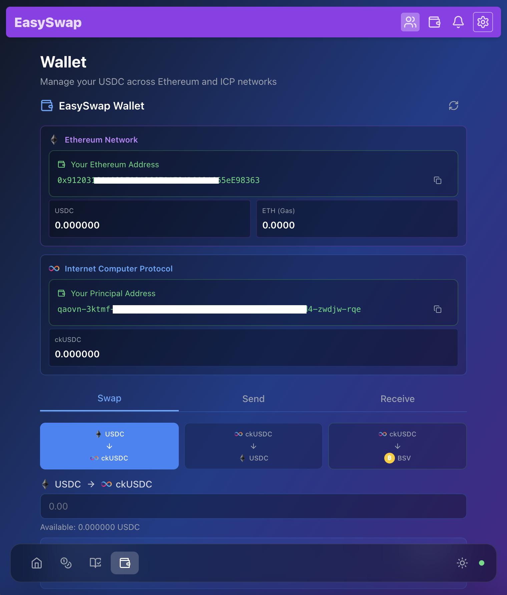
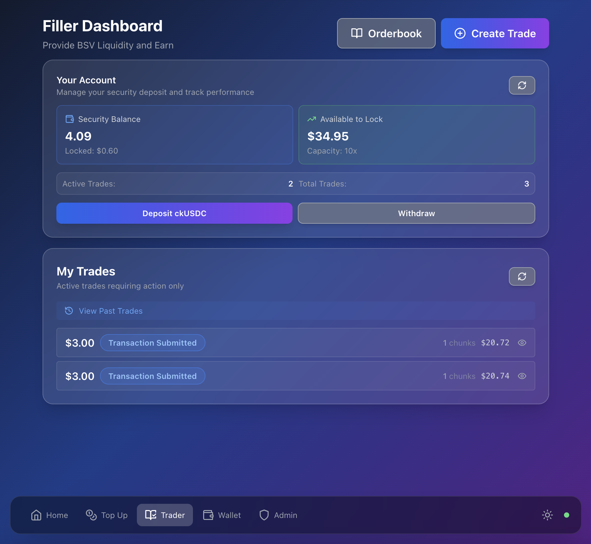

# ckUSDC ⇄ BSV Orderbook (EasySwap)

**Proprietary Open-Source Exchange Protocol**

A decentralized peer-to-peer orderbook for atomic swaps between USDC and BSV (Bitcoin SV) using Internet Computer's Chain-Key USDC (ckUSDC).

---

## ⚠️ LICENSE

This software is licensed under the **Business Source License 1.1 (BSL)** with developer royalty requirements.

**See [LICENSE.md](./LICENSE.md) for complete terms and conditions.**

**Key Points:**
- ✅ Source code available for audit and inspection
- ✅ Free for non-commercial use (learning, testing)
- ✅ Modifications allowed - change any fees, timeouts, or parameters
- ✅ Commercial forks allowed with custom fee structures
- ⚠️ Must pay 2.5% developer royalty on activations (or agreed rate)
- ⚠️ Software provided "as-is" with zero liability

---

## Overview

⚠️ **INTENDED FOR SMALL TRANSACTIONS ONLY** - This software is designed for very small orders. Users accept all risks without expectation of recompense in the event of disaster, loss, or technical failure.

This orderbook enables peer-to-peer atomic swaps between:
- **Makers**: Create orders to sell ckUSDC for BSV
- **Fillers**: Fill orders by sending BSV on-chain and claiming ckUSDC

## Preview

### Home Page


### Swaps View


### Trades View


## Key Features

✅ **Autonomous P2P Exchange** - Direct peer-to-peer trades with no intermediary  
✅ **On-Chain BSV Settlement** - Fillers send BSV directly to maker addresses  
✅ **SPV Verification** - BUMP proofs verify BSV transactions before ckUSDC release  
✅ **Immutable Rules** - All fees, timeouts, and parameters hardcoded  
✅ **Security Deposits** - Fillers stake 10% ckUSDC collateral  
✅ **Flexible Fills** - Orders chunked at $3 minimum for partial filling  

## Architecture

### Smart Contract (ICP Canister)
- **Backend**: Rust-based canister handling orders, trades, and SPV verification
- **Frontend**: React web interface for order creation and trade execution
- **Storage**: ic-stable-structures for persistent orderbook state
- **BSV Integration**: HTTP outcalls to WoC/Bitails APIs for block sync

### Key Components
1. **Order Management** - Create, activate, cancel, refund orders
2. **Trade Lifecycle** - Lock chunks, submit BSV tx, verify SPV, claim ckUSDC
3. **Block Sync** - Autonomous 20-minute sync of BSV blockchain headers
4. **SPV Verification** - BUMP proof validation for transaction inclusion
5. **Heartbeat System** - Automated confirmations, timeouts, penalties, reactivation

## User Flow

### For Makers (Selling ckUSDC for BSV)

1. **Create Order** - Specify USD amount, max BSV price, BSV address
2. **Deposit ckUSDC** - Send to unique subaccount (order amount + 7% fee)
3. **Confirm Deposit** - System checks ledger balance
4. **Auto-Activation** - 2.5% activation fee sent to treasury, order goes live
5. **Receive BSV** - Fillers send BSV directly to your address on-chain
6. **No Waiting** - BSV is yours immediately, no confirmations needed

### For Fillers (Buying ckUSDC with BSV)

1. **Deposit Security** - 10% ckUSDC collateral (enables trades up to 10x)
2. **Create Trade** - Select orders to fill at current market price
3. **Send BSV** - Transfer BSV on-chain to maker addresses within 45 minutes
4. **Submit Tx Hex** - Provide raw BSV transaction hex to canister
5. **Wait 3 Hours** - Allow BSV transaction to receive 18 block confirmations
6. **Claim ckUSDC** - Provide BUMP proof, receive order amount + 4.5% incentive

## Running the Project Locally

### Prerequisites
```bash
# Install dfx (Internet Computer SDK)
sh -ci "$(curl -fsSL https://internetcomputer.org/install.sh)"

# Install Node.js dependencies
npm install
```

### Local Development
```bash
# Start local replica
dfx start --background

# Deploy canisters
dfx deploy

# Access frontend
# http://localhost:4943?canisterId={frontend_canister_id}
```

### Generate Candid Interface
```bash
npm run generate
```

### Frontend Development Server
```bash
npm start
```

## Risk Warnings

### ⚠️ Use at Your Own Risk

You may lose 100% of deposited funds due to:
- Smart contract bugs or exploits
- ICP or BSV network failures
- Blockchain reorgs invalidating transactions
- SPV verification failures
- Extreme price volatility (±20%+ swings)
- ckUSDC depeg or Circle USDC issues
- Canister cycle exhaustion or storage overflow
- HTTP outcall failures to BSV APIs
- Regulatory changes or seizures
- Key loss or phishing attacks

**NO CUSTOMER SUPPORT, REFUNDS, OR RECOMPENSE AVAILABLE.**

See full risk disclosure in the [Terms of Use](./src/usdcbsv_orderbook_frontend/src/pages/DisclaimerPage.jsx).

## Technical Specifications

### Fee Structure (Hardcoded)
- **Maker Total Fee**: 7.0% (2.5% activation + 4.5% filler incentive)
- **Activation Fee**: 2.5% (sent to treasury, non-refundable)
- **Filler Incentive**: 4.5% (reserved with order, paid on completion)
- **Security Deposit**: 10% (filler collateral, refundable)
- **Timeout Penalty**: 10% (deducted if filler misses 30-min deadline)
- **Resubmission Penalty**: 2% (charged if filler edits BSV tx within 2 hours)

### Time Constraints (Immutable)
- **Trade Timeout**: 45 minutes (submit BSV tx or lose 5% security)
- **USDC Release Wait**: 3 hours (after BSV tx submission)
- **BSV Confirmations**: 18 blocks (~3 hours) required for claim
- **Resubmission Window**: 3 hours (from initial tx submission)
- **Claim Expiry**: 24 hours (unclaimed funds to treasury)

### Limits (Hardcoded)
- **Min Chunk Size**: $3 USD
- **Max Chunks**: 30 per order
- **Max Order Size**: $90 USD (for security)
- **Orderbook Limit**: $2,000 total available
- **Maker Limit**: $210 active orders per user
- **Filler Leverage**: 10 security deposit (10% enables $100 trades with $5 security)

## Development Stack

- **Backend**: Rust + ic-cdk
- **Frontend**: React + Vite + TailwindCSS
- **Storage**: ic-stable-structures (StableBTreeMap)
- **BSV Integration**: HTTP outcalls to WoC/Bitails APIs
- **SPV**: BUMP proof verification with merkle path validation
- **Tokens**: ICRC-1 (ckUSDC ledger)

## Support & Contributions

**No Support Available**: This is autonomous software with zero customer service or technical assistance.

**Contributions**: Bug fixes and security improvements welcome. Feature requests subject to developer discretion and must maintain fee/timeout/rules immutability.

## Disclaimer

This software is provided "AS IS" with no warranties. Developers have zero liability for losses. Use only amounts you can afford to lose completely. See full terms in [DisclaimerPage.jsx](./src/usdcbsv_orderbook_frontend/src/pages/DisclaimerPage.jsx).

---

**© 2025 - Business Source License 1.1 - Converts to MPL 2.0 on 2029-01-01**
